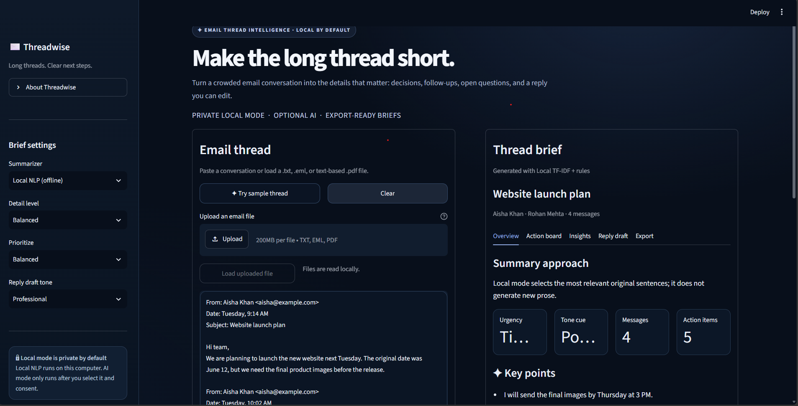

# Threadwise — Email Thread Intelligence

**Long threads. Clear next steps.** Threadwise turns an email conversation into a readable brief, action tracker, and editable reply draft. Built with Python and Streamlit, it offers a private local mode plus optional generative AI.

## Features

- Paste email text or upload `.txt`, `.eml`, or text-based `.pdf` files.
- Local extractive NLP: TF-IDF key sentence ranking, decision/question detection, likely owners and deadlines, risk cues, urgency, tone cues, and topic keywords.
- Optional OpenAI mode for a concise natural-language brief, richer extraction, and a reply draft. It is opt-in and requires a separate API key.
- Detail level and focus controls for decisions or action items.
- Action board, risks/blockers, thread insights, and editable reply draft.
- Export the brief as `.txt` or `.json`, and action items as `.csv`.
- Recent brief list held in app-session memory only; source emails are not put in that list.
- Navy interface with an About panel, sample email, word count, and reading-time estimate.

## Run locally on Windows

Use standard (GIL-enabled) Python 3.12 on Windows. Avoid free-threaded builds marked `3.13t`, which may not have compatible wheels for every dependency. In VS Code, open this folder and choose **Terminal → New Terminal**:

```powershell
py -3.12 -m venv .venv-standard
.\.venv-standard\Scripts\python.exe -m pip install --upgrade pip setuptools wheel
.\.venv-standard\Scripts\python.exe -m pip install -r requirements.txt
.\.venv-standard\Scripts\python.exe -m streamlit run app.py
```

Open the local address printed in the terminal. Stop the app with **Ctrl+C**.

Use the environment's Python directly each time you install packages or run the app. This avoids accidentally using another Python installation selected in VS Code:

```powershell
.\.venv-standard\Scripts\python.exe -m pip install -r requirements.txt
.\.venv-standard\Scripts\python.exe -m streamlit run app.py
```

## Optional OpenAI mode

Local NLP is the default and does not need an API key or internet access. To enable the optional AI mode:

1. Copy `.streamlit/secrets.toml.example` to `.streamlit/secrets.toml`.
2. Replace the placeholder with an OpenAI API key and save the file.
3. Restart Streamlit, choose **OpenAI AI (API)**, and check the consent box before summarizing.

The app sends the submitted thread to the OpenAI API only after AI mode is selected and consent is checked. API usage may be billed by the provider. Never commit the real `secrets.toml`; Git ignores it. You can also set `OPENAI_API_KEY` and `OPENAI_MODEL` as environment variables.

If AI mode reports `credit_balance_exhausted` or says there are no credits remaining, the API key was accepted but the API account has no available balance. Add credits in the OpenAI API billing settings to use AI mode. The local NLP mode continues to work without API credits.

## Project layout

| File | Purpose |
| --- | --- |
| `app.py` | Streamlit interface, input handling, settings, history, and exports |
| `summarizer.py` | Local TF-IDF ranking and rule-based signals |
| `ai_summarizer.py` | Optional OpenAI Responses API extraction with a strict JSON schema |
| `.streamlit/config.toml` | Navy theme |
| `.streamlit/secrets.toml.example` | Safe template for local API configuration |
| `requirements.txt` | Python package dependencies |

## Limitations

Local mode is extractive and does not generate a new prose summary. Its owner, deadline, tone, urgency, and risk cues are heuristic estimates. AI mode can also make mistakes; review important statements against the original thread before acting. Scanned PDFs need OCR before upload. Threadwise does not connect to an email account or send replies.

## GitHub checklist

- Keep `.streamlit/secrets.toml` and `.env` out of commits.
- Commit the example secrets file only; it contains no working credential.
- Include the README and requirements file so others can install the app.
- Do not upload real customer or personal email threads as sample data.

## Add a screenshot or demo GIF

The project folder includes an `assets` directory for GitHub visuals. Capture the real app after starting it locally; use the sample thread so the screenshot contains only demo data.

### Screenshot (recommended)

1. Start Threadwise with `python -m streamlit run app.py` and open the local URL in your browser.
2. Select **Try sample thread**, then **Build thread brief**. Open the Overview tab and adjust the browser zoom so the app looks tidy.
3. Press **Win + Shift + S**, select the app area, then save the capture as `assets/threadwise-demo.png`.
4. Add this image near the top of this README, below the one-line description:

   ```markdown
   
   ```

### Short demo GIF (optional)

Use a screen recorder such as ScreenToGif to record a 10–20 second walkthrough: load the sample, build a brief, show the Action board, then show Export. Save it as `assets/threadwise-demo.gif`. Keep the recording small and use sample data only. Add it to the README with:

```markdown

```

## Publish this folder to GitHub

1. Sign in to GitHub in your browser and create a **new empty repository** named `threadwise-email-summarizer`. Do not initialize it with a README, license, or `.gitignore` because those files already exist here. Copy the repository's HTTPS URL.
2. Open this project folder in VS Code and choose **Terminal → New Terminal**. Check that the prompt is in the `Email Thread Summarizer` folder.
3. Run these commands one at a time. Replace the URL with the one GitHub shows for your repository:

   ```powershell
   git init -b main
   git status --short
   git check-ignore .streamlit/secrets.toml
   git add .
   git status
   git commit -m "Build Threadwise email thread summarizer"
   git remote add origin https://github.com/YOUR-USERNAME/threadwise-email-summarizer.git
   git push -u origin main
   ```

   `git check-ignore` should print `.streamlit/secrets.toml`. If it does not, stop before `git add` and check `.gitignore`. In `git status`, make sure `.venv`, `.venv312`, `__pycache__`, and any real secrets are absent before committing.

4. Refresh the GitHub repository page. Confirm the README, source files, requirements, and screenshot appear. The README tells visitors how to install and run the app.

If Git asks who made the commit, set your author name and email in this terminal, then retry the commit:

```powershell
git config --global user.name "Your Name"
git config --global user.email "the-email-on-your-github-account"
```
